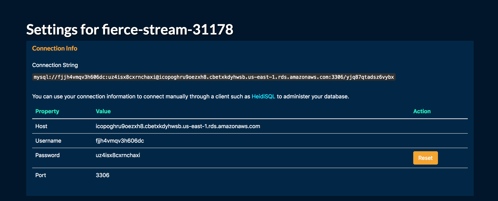

# SQL-336
* Building a full stack project with SQL, JavaScript, &amp; Node.js

### Heroku URL & Connection Details
---
* URL: https://fierce-stream-31178.herokuapp.com/
* Remote Heroku Database Connection:

* Endpoint: icopoghru9oezxh8.cbetxkdyhwsb.us-east-1.rds.amazonaws.com
* Username: fjjh4vmqv3h606dc
* Password: uz4isx8cxrnchaxi

* URL for AWS: https://whispering-ravine-45227.herokuapp.com

### AWS Database Connection Information
---
* Endpoint: comicdb.cc24nnrynf7v.us-east-2.rds.amazonaws.com
* Username: comic
* Password: Comic

### Environment Instructions
---
1. run 'npm install' in base directory
2. run 'node server.js'
3. open a browser and navigate to 'localhost:8080'

### POST HANDLEBARS PACKAGES

1. You might have to rm -rf node_modules, and do npm install again if it doesn't work
2. do npm install --save consolidate
3. npm install --save swig
4. npm install --save handlebars
5. npm install --save express-handlebars
6. npm install --save hbs
7. if node says it cant find module x, do npm install --save x until it goes away

TO DO
Fill in database
Implement favoriting and unfavoriting
Viewing entities (i.e. comics, characters, etc)
Complex queries
Display
Sessions
Implementation of Recommendations

WORKING ON
Vincent - Sessions implementation, user browsing and filtering
Nick - Database setup and queries
Steven - Frontend build out - search, adding comics, etc.
Patrick - 

MARVEL API PUBLIC KEYS/PRIVATE KEYS
vince:

* PUBLIC KEY: 0530605a5d4c6e96e9782997b7bf1104
* PRIVATE KEY: d63ae0b16542977fc2df246fb9ab1a6b4638f59f

steve:

* PUBLIC KEY: 365361147b7071f4750ccf1ce63873f5
* PRIVATE KEY: a09770bc2d426a517eebfc096825ba6ee9346ce8

IP : 172.31.231.85
